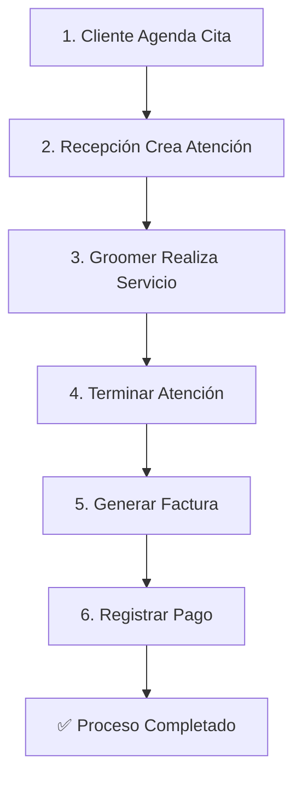

# 📘 Manual Completo: Flujo de Negocio Cita → Atención → Factura → Pago

**Proyecto:** Veterinaria SpringBoot  
**Módulo:** Flujo Completo de Negocio  
**Base URL:** `http://localhost:8080`  
**Fecha:** 2025-11-24

---

## 📑 Índice

1. [Introducción al Flujo de Negocio](#introducción-al-flujo-de-negocio)
2. [Configuración Inicial](#configuración-inicial)
3. [Flujo Completo Paso a Paso](#flujo-completo-paso-a-paso)
4. [Escenarios de Prueba](#escenarios-de-prueba)
5. [Validaciones y Verificaciones](#validaciones-y-verificaciones)
6. [Casos de Error Comunes](#casos-de-error-comunes)
7. [Checklist de Prueba Completa](#checklist-de-prueba-completa)

---

## 🔄 Introducción al Flujo de Negocio

El sistema sigue este flujo para gestionar el servicio completo desde que un cliente agenda una cita hasta que paga:



### Estados y Transiciones

**Cita:**
- `reservada` → `confirmada` → `atendido`

**Atención:**
- `en_espera` → `en_servicio` → `terminado`

**Factura:**
- `emitida` → `pagada` / `anulada`

**Pago:**
- `confirmado` (único estado)

---

## 🔧 Configuración Inicial

### 1. Variables de Entorno en Postman

```json
{
  "baseUrl": "http://localhost:8080",
  "token": "{{tu_jwt_token}}",
  "idCliente": "1",
  "idMascota": "1",
  "idServicio": "1",
  "idSucursal": "1",
  "idGroomer": "1",
  "idCita": "",
  "idAtencion": "",
  "idFactura": "",
  "idPago": ""
}
```

### 2. Obtener Token de Autenticación

```http
POST {{baseUrl}}/api/auth/login
Content-Type: application/json

{
  "usuario": "admin",
  "password": "admin123"
}
```

**Respuesta:**
```json
{
  "exito": true,
  "datos": {
    "token": "eyJhbGciOiJIUzI1NiIsInR5cCI6IkpXVCJ9..."
  }
}
```

**💡 Acción:** Guarda el token en la variable `{{token}}`.

### 3. Headers para Todos los Requests

```
Authorization: Bearer {{token}}
Content-Type: application/json
```

---

## 📋 Flujo Completo Paso a Paso

### PASO 1: Crear una Cita

**Objetivo:** El cliente agenda una cita para un servicio

**Endpoint:**
```http
POST {{baseUrl}}/api/citas
Authorization: Bearer {{token}}
Content-Type: application/json

{
  "idMascota": 1,
  "idCliente": 1,
  "idSucursal": 1,
  "idServicio": 1,
  "fechaProgramada": "2025-11-26T10:00:00",
  "modalidad": "presencial",
  "notas": "Cliente solicita groomer María González"
}
```

**Respuesta Esperada:** HTTP 201 CREATED
```json
{
  "exito": true,
  "mensaje": "Cita creada exitosamente",
  "datos": "Registro creado en base de datos"
}
```

**✅ Validación:**
```sql
SELECT id_cita, estado, fecha_programada 
FROM cita 
ORDER BY id_cita DESC 
LIMIT 1;
```

**💡 Acción:** Guarda el `id_cita` en la variable `{{idCita}}` (ej: 15).

---

### PASO 2: Consultar la Cita Creada

**Endpoint:**
```http
GET {{baseUrl}}/api/citas
Authorization: Bearer {{token}}
```

**Respuesta:**
```json
{
  "exito": true,
  "datos": [
    {
      "idCita": 15,
      "idMascota": 1,
      "nombreMascota": "Max",
      "idCliente": 1,
      "nombreCliente": "Juan Pérez",
      "estado": "reservada",
      "fechaProgramada": "2025-11-26T10:00:00",
      ...
    }
  ]
}
```

**✅ Validación:** Confirma que `estado = "reservada"`.

---

### PASO 3: Crear Atención desde la Cita

**Objetivo:** Cuando el cliente llega, crear la atención para iniciarel servicio

**Endpoint:**
```http
POST {{baseUrl}}/api/atenciones/desde-cita
Authorization: Bearer {{token}}
Content-Type: application/x-www-form-urlencoded

idCita=15
&idGroomer=1
&idSucursal=1
&turnoNum=1
&tiempoEstimadoInicio=2025-11-26T10:00:00
&tiempoEstimadoFin=2025-11-26T11:30:00
&prioridad=1
```

**⚠️ IMPORTANTE:** Los parámetros se envían como **form-urlencoded**, NO como JSON.

**En Postman:**
1. Método: POST
2. URL: `{{baseUrl}}/api/atenciones/desde-cita`
3. Headers: `Authorization: Bearer {{token}}`
4. Body: Selecciona **x-www-form-urlencoded**
5. Agrega cada parámetro como key-value

**Respuesta Esperada:** HTTP 201 CREATED
```json
{
  "exito": true,
  "mensaje": "Atención creada exitosamente desde la cita",
  "datos": null
}
```

**✅ Validación:**
```sql
SELECT id_atencion, estado, id_cita 
FROM atencion 
WHERE id_cita = 15;
```

**💡 Acción:** Guarda el `id_atencion` que obtuviste de la BD en `{{idAtencion}}` (ej: 20).

**Verificar Cambio de Estado de Cita:**
```sql
SELECT id_cita, estado 
FROM cita 
WHERE id_cita = 15;
```
Debería cambiar de `reservada` a `atendido`.

---

### PASO 4: Consultar la Atención Creada

**Endpoint:**
```http
GET {{baseUrl}}/api/atenciones/20
Authorization: Bearer {{token}}
```

**Respuesta:**
```json
{
  "exito": true,
  "mensaje": "Atención obtenida exitosamente",
  "datos": {
    "idAtencion": 20,
    "cita": {
      "idCita": 15,
      "mascota": {
        "idMascota": 1,
        "cliente": {
          "idCliente": 1,
          "nombre": "Juan",
          "apellido": "Pérez",
          "dniRuc": "12345678",
          "email": "juan.perez@mail.com",
          "telefono": "987654321",
          "direccion": "Av. Principal 123",
          "preferencias": null,
          "createdAt": "2025-11-15T10:00:00",
          "updatedAt": "2025-11-15T10:00:00"
        },
        "nombre": "Max",
        "especie": "perro",
        "raza": "Golden Retriever",
        "sexo": "macho",
        "fechaNacimiento": "2022-05-15",
        "microchip": null,
        "observaciones": null,
        "createdAt": "2025-11-15T10:00:00",
        "updatedAt": "2025-11-15T10:00:00"
      },
      "cliente": {
        "idCliente": 1,
        "nombre": "Juan",
        "apellido": "Pérez",
        "dniRuc": "12345678",
        "email": "juan.perez@mail.com",
        "telefono": "987654321",
        "direccion": "Av. Principal 123",
        "preferencias": null,
        "createdAt": "2025-11-15T10:00:00",
        "updatedAt": "2025-11-15T10:00:00"
      },
      "sucursal": {
        "idSucursal": 1,
        "nombre": "Sucursal Central",
        "direccion": "Av. Principal 123, Lima",
        "telefono": "987654321",
        "createdAt": "2025-11-15T10:00:00",
        "updatedAt": "2025-11-15T10:00:00"
      },
      "servicio": {
        "idServicio": 1,
        "codigo": "B001",
        "nombre": "Baño Básico",
        "descripcion": "Limpieza básica, shampoo, secado",
        "duracionEstimadaMin": 45,
        "precioBase": 35.00,
        "categoria": "baño",
        "createdAt": "2025-11-15T10:00:00",
        "updatedAt": "2025-11-15T10:00:00"
      },
      "fechaProgramada": "2025-11-26T10:00:00",
      "modalidad": "presencial",
      "estado": "atendido",
      "notas": "Cliente solicita groomer María González",
      "createdAt": "2025-11-25T14:30:00",
      "updatedAt": "2025-11-26T10:00:00"
    },
    "mascota": {
      "idMascota": 1,
      "nombre": "Max",
      "especie": "perro",
      "raza": "Golden Retriever",
      ...
    },
    "cliente": {
      "idCliente": 1,
      "nombre": "Juan",
      "apellido": "Pérez",
      ...
    },
    "groomer": {
      "idGroomer": 1,
      "nombre": "María González",
      "especialidades": "{\"principales\":[\"corte_raza\",\"baño_premium\"]}",
      "disponibilidad": "{\"lunes\":{\"inicio\":\"09:00\",\"fin\":\"18:00\"}}",
      ...
    },
    "sucursal": {
      "idSucursal": 1,
      "nombre": "Sucursal Central",
      ...
    },
    "estado": "en_espera",
    "turnoNum": 1,
    "tiempoEstimadoInicio": "2025-11-26T10:00:00",
    "tiempoEstimadoFin": "2025-11-26T11:30:00",
    "tiempoRealInicio": null,
    "tiempoRealFin": null,
    "prioridad": 1,
    "observaciones": null,
    "createdAt": "2025-11-26T09:55:00",
    "updatedAt": "2025-11-26T09:55:00"
  },
  "error": null
}
```

**⚠️ NOTA IMPORTANTE:**

La respuesta incluye **TODA la información relacionada**:
- Cita completa con mascota, cliente, sucursal y servicio
- Mascota duplicada (aparece dentro de cita y como campo directo)
- Cliente duplicado (aparece dentro de cita y como campo directo)
- Groomer completo
- Sucursal completa

**Esto es porque las relaciones están configuradas como LAZY pero se cargan al serializar**. La respuesta es muy verbosa pero contiene toda la información necesaria.

**✅ Validación:** Confirma que `estado = "en_espera"`.

**Campos Clave a Verificar:**
- `idAtencion`: ID de la atención
- `estado`: `"en_espera"` (estado inicial)
- `cita.estado`: `"atendido"` (la cita cambió de estado)
- `tiempoRealInicio`: `null` (aún no inicia el servicio)
- `tiempoRealFin`: `null` (aún no termina el servicio)

---

### PASO 5: Iniciar el Servicio (Cambiar a "en_servicio")

**Endpoint:**
```http
PUT {{baseUrl}}/api/atenciones/20/estado?nuevoEstado=en_servicio
Authorization: Bearer {{token}}
```

**Respuesta:**
```json
{
  "exito": true,
  "mensaje": "Estado actualizado exitosamente",
  "datos": {
    "idAtencion": 20,
    "estado": "en_servicio",
    ...
  }
}
```

**✅ Validación:** `estado` cambió a `"en_servicio"`.

---

### PASO 6: Terminar la Atención

**Objetivo:** Cuando el servicio termina, marcar la atención como terminada

**Endpoint:**
```http
PUT {{baseUrl}}/api/atenciones/20/terminar
Authorization: Bearer {{token}}
```

**Respuesta:**
```json
{
  "exito": true,
  "mensaje": "Atención terminada exitosamente",
  "datos": {
    "idAtencion": 20,
    "estado": "terminado",
    "tiempoRealInicio": "2025-11-26T10:05:00",
    "tiempoRealFin": "2025-11-26T11:25:00"
  }
}
```

**✅ Validación:**
- `estado = "terminado"`
- `tiempoRealFin` tiene valor (no NULL)

---

### PASO 6.5: Agregar Detalles de Servicio

**Objetivo:** Registrar los servicios realizados en la atención con sus precios

**⚠️ PASO CRUCIAL:** Sin este paso, la factura tendrá totales en 0.00

**Endpoint:**
```http
POST {{baseUrl}}/api/atenciones/20/detalles
Authorization: Bearer {{token}}
Content-Type: application/json

{
  "servicio": {
    "idServicio": 1
  },
  "cantidad": 1,
  "precioUnitario": 35.00,
  "subtotal": 35.00,
  "observaciones": "Baño completo con champú especial"
}
```

**Campos del Request:**

| Campo | Tipo | Requerido | Descripción |
|-------|------|-----------|-------------|
| `servicio.idServicio` | Integer | ✅ Sí | ID del servicio realizado |
| `cantidad` | Integer | ✅ Sí | Cantidad de veces que se realizó |
| `precioUnitario` | Decimal | ✅ Sí | Precio por unidad |
| `subtotal` | Decimal | ✅ Sí | Total (cantidad × precioUnitario) |
| `observaciones` | String | ❌ No | Notas sobre el servicio |

**Respuesta Esperada:** HTTP 201 CREATED
```json
{
  "exito": true,
  "mensaje": "Detalle creado correctamente",
  "datos": {
    "idDetalle": 5,
    "atencion": {
      "idAtencion": 20
    },
    "servicio": {
      "idServicio": 1,
      "codigo": "B001",
      "nombre": "Baño Básico",
      "precioBase": 35.00,
      ...
    },
    "cantidad": 1,
    "precioUnitario": 35.00,
    "subtotal": 35.00,
    "observaciones": "Baño completo con champú especial",
    "createdAt": "2025-11-26T11:26:00"
  },
  "error": null
}
```

**✅ Validación:**
```sql
SELECT id_detalle, id_servicio, cantidad, precio_unitario, subtotal 
FROM detalle_servicio 
WHERE id_atencion = 20;
```

**💡 Si se realizaron varios servicios, agrégalos todos:**

**Ejemplo - Agregar segundo servicio (corte de uñas):**
```http
POST {{baseUrl}}/api/atenciones/20/detalles
Content-Type: application/json

{
  "servicio": {
    "idServicio": 8
  },
  "cantidad": 1,
  "precioUnitario": 15.00,
  "subtotal": 15.00,
  "observaciones": "Corte y limado de uñas"
}
```

**Verificar subtotal total:**
```http
GET {{baseUrl}}/api/atenciones/20/detalles/subtotal
```

**Respuesta:**
```json
{
  "exito": true,
  "mensaje": "Subtotal calculado correctamente",
  "datos": 50.00,  // 35.00 + 15.00
  "error": null
}
```

---

### PASO 7: Generar Factura

**Objetivo:** Crear la factura para cobrar los servicios

**Endpoint:**
```http
POST {{baseUrl}}/api/facturas
Authorization: Bearer {{token}}
Content-Type: application/x-www-form-urlencoded

idAtencion=20
&serie=F001
&numero=00015
&metodoPagoSugerido=efectivo
```

**⚠️ IMPORTANTE:** También se envía como **form-urlencoded**.

**En Postman:**
1. Método: POST
2. URL: `{{baseUrl}}/api/facturas`
3. Body: **x-www-form-urlencoded**
4. Parámetros:
   - `idAtencion`: 20
   - `serie`: F001
   - `numero`: 00015
   - `metodoPagoSugerido`: efectivo

**Respuesta Esperada:** HTTP 201 CREATED
```json
{
  "exito": true,
  "mensaje": "Factura creada exitosamente",
  "datos": "Factura registrada en la BD"
}
```

**✅ Validación:**
```sql
SELECT id_factura, numero_completo, total, estado_pago 
FROM factura 
WHERE id_atencion = 20;
```

**💡 Acción:** Guarda el `id_factura` en `{{idFactura}}` (ej: 12).

---

### PASO 8: Consultar la Factura Generada

**Endpoint:**
```http
GET {{baseUrl}}/api/facturas/12
Authorization: Bearer {{token}}
```

**Respuesta:**
```json
{
  "exito": true,
  "mensaje": "Factura obtenida exitosamente",
  "datos": {
    "idFactura": 12,
    "serie": "F001",
    "numero": "00015",
    "atencion": {
      "idAtencion": 20,
      "cita": {
        "idCita": 15,
        "mascota": {
          "idMascota": 1,
          "cliente": {
            "idCliente": 1,
            "nombre": "Juan",
            "apellido": "Pérez",
            "dniRuc": "12345678",
            "email": "juan.perez@mail.com",
            "telefono": "987654321",
            "direccion": "Av. Principal 123",
            "preferencias": null,
            "createdAt": "2025-11-15T10:00:00",
            "updatedAt": "2025-11-15T10:00:00"
          },
          "nombre": "Max",
          "especie": "perro",
          "raza": "Golden Retriever",
          "sexo": "macho",
          "fechaNacimiento": "2022-05-15",
          "microchip": null,
          "observaciones": null,
          "createdAt": "2025-11-15T10:00:00",
          "updatedAt": "2025-11-15T10:00:00"
        },
        "cliente": {
          "idCliente": 1,
          "nombre": "Juan",
          "apellido": "Pérez",
          ...
        },
        "sucursal": {
          "idSucursal": 1,
          "nombre": "Sucursal Central",
          "direccion": "Av. Principal 123, Lima",
          "telefono": "987654321",
          ...
        },
        "servicio": {
          "idServicio": 1,
          "codigo": "B001",
          "nombre": "Baño Básico",
          "descripcion": "Limpieza básica, shampoo, secado",
          "duracionEstimadaMin": 45,
          "precioBase": 35.00,
          "categoria": "baño",
          ...
        },
        "fechaProgramada": "2025-11-26T10:00:00",
        "modalidad": "presencial",
        "estado": "atendido",
        "notas": "Cliente solicita groomer María González",
        ...
      },
      "mascota": {
        "idMascota": 1,
        "cliente": { ... },
        "nombre": "Max",
        "especie": "perro",
        "raza": "Golden Retriever",
        ...
      },
      "cliente": {
        "idCliente": 1,
        "nombre": "Juan",
        "apellido": "Pérez",
        ...
      },
      "groomer": {
        "idGroomer": 1,
        "nombre": "María González",
        "especialidades": "[\"corte_raza\", \"baño_premium\"]",
        "disponibilidad": "{\"Lun\": \"9-17\", \"Mar\": \"9-17\"}",
        ...
      },
      "sucursal": {
        "idSucursal": 1,
        "nombre": "Sucursal Central",
        ...
      },
      "estado": "terminado",
      "turnoNum": 1,
      "tiempoEstimadoInicio": "2025-11-26T10:00:00",
      "tiempoEstimadoFin": "2025-11-26T11:30:00",
      "tiempoRealInicio": "2025-11-26T10:05:00",
      "tiempoRealFin": "2025-11-26T11:25:00",
      "prioridad": 1,
      "observaciones": null,
      ...
    },
    "cliente": {
      "idCliente": 1,
      "nombre": "Juan",
      "apellido": "Pérez",
      "dniRuc": "12345678",
      "email": "juan.perez@mail.com",
      "telefono": "987654321",
      "direccion": "Av. Principal 123",
      "preferencias": null,
      ...
    },
    "fechaEmision": "2025-11-26T11:30:00",
    "subtotal": 35.00,
    "impuesto": 6.30,
    "descuentoTotal": 0.00,
    "total": 41.30,
    "estado": "emitida",
    "metodoPagoSugerido": "efectivo",
    "createdAt": "2025-11-26T11:30:00",
    "updatedAt": "2025-11-26T11:30:00"
  },
  "error": null
}
```

**⚠️ NOTA IMPORTANTE:**

La respuesta incluye **TODA la información relacionada** en forma anidada:
- **Atención completa** con todos sus detalles
  - **Cita completa** dentro de atención
    - Mascota con su cliente
    - Cliente (duplicado)
    - Sucursal
    - Servicio
  - Mascota (duplicada como campo directo de atención)
  - Cliente (duplicado como campo directo de atención)
  - Groomer completo
  - Sucursal (duplicada)
- **Cliente** (tercera vez, como campo directo de factura)

**La respuesta es extremadamente verbosa** debido a que todas las relaciones LAZY se cargan al serializar. Contiene información duplicada múltiples veces pero es correcta.

**✅ Validaciones Clave:**

Enfócate en estos campos principales de la factura:
- `idFactura`: 12
- `serie`: "F001"
- `numero`: "00015"
- `fechaEmision`: Fecha y hora de generación
- `subtotal`: Suma de servicios sin impuesto
- `impuesto`: IGV u otro impuesto (18% en Perú)
- `descuentoTotal`: Descuentos aplicados
- `total`: Monto total a pagar (`subtotal + impuesto - descuentoTotal`)
- `estado`: `"emitida"` (inicial)
- `metodoPagoSugerido`: `"efectivo"`, `"tarjeta"`, etc.

**⚠️ Observación sobre los Totales:**

Si ves `subtotal: 0.00`, `impuesto: 0.00`, `total: 0.00`, significa que:
- El sistema no calculó automáticamente los totales
- Probablemente faltan detalles de servicio asociados a la atención
- O el stored procedure que crea la factura no está calculando correctamente

**Para verificar que los totales son correctos:**
```sql
SELECT subtotal, impuesto, descuento_total, total 
FROM factura 
WHERE id_factura = 12;
```

Si los totales están en 0, necesitarás ejecutar el endpoint de recalcular totales:
```http
POST {{baseUrl}}/api/facturas/recalcular
```

---

### PASO 9: Registrar Pago

**Objetivo:** Registrar el pago del cliente

**Endpoint:**
```http
POST {{baseUrl}}/api/pagos
Authorization: Bearer {{token}}
Content-Type: application/x-www-form-urlencoded

idFactura=12
&monto=59.00
&metodo=efectivo
&referencia=PAGO-EFECTIVO-001
```

**⚠️ IMPORTANTE:** También **form-urlencoded**.

**Parámetros:**
- `idFactura`: 12 (obligatorio)
- `monto`: 59.00 (obligatorio)
- `metodo`: efectivo / tarjeta / yape / plin (obligatorio)
- `referencia`: Número de operación (opcional)

**Respuesta Esperada:** HTTP 201 CREATED
```json
{
  "exito": true,
  "mensaje": "Pago registrado exitosamente",
  "datos": "Pago confirmado"
}
```

**✅ Validación:**
```sql
SELECT id_pago, monto, metodo, estado 
FROM pago 
WHERE id_factura = 12;
```

**💡 Acción:** Guarda el `id_pago` en `{{idPago}}` (ej: 8).

---

### PASO 10: Verificar Estado de la Factura

**Endpoint:**
```http
GET {{baseUrl}}/api/facturas/12
Authorization: Bearer {{token}}
```

**Respuesta:**
```json
{
  "exito": true,
  "mensaje": "Factura obtenida exitosamente",
  "datos": {
    "idFactura": 12,
    "serie": "F001",
    "numero": "00015",
    "atencion": {
      "idAtencion": 20,
      "cita": {
        "idCita": 15,
        "mascota": {
          "idMascota": 1,
          "cliente": {
            "idCliente": 1,
            "nombre": "Juan",
            "apellido": "Pérez",
            "dniRuc": "12345678",
            "email": "juan.perez@mail.com",
            "telefono": "987654321",
            "direccion": "Av. Principal 123",
            "preferencias": null,
            "createdAt": "2025-11-15T10:00:00",
            "updatedAt": "2025-11-15T10:00:00"
          },
          "nombre": "Max",
          "especie": "perro",
          "raza": "Golden Retriever",
          "sexo": "macho",
          "fechaNacimiento": "2022-05-15",
          "microchip": null,
          "observaciones": null,
          "createdAt": "2025-11-15T10:00:00",
          "updatedAt": "2025-11-15T10:00:00"
        },
        "cliente": {
          "idCliente": 1,
          "nombre": "Juan",
          "apellido": "Pérez",
          ...
        },
        "sucursal": {
          "idSucursal": 1,
          "nombre": "Sucursal Central",
          "direccion": "Av. Principal 123, Lima",
          "telefono": "987654321",
          ...
        },
        "servicio": {
          "idServicio": 1,
          "codigo": "B001",
          "nombre": "Baño Básico",
          "descripcion": "Limpieza básica, shampoo, secado",
          "duracionEstimadaMin": 45,
          "precioBase": 35.00,
          "categoria": "baño",
          ...
        },
        "fechaProgramada": "2025-11-26T10:00:00",
        "modalidad": "presencial",
        "estado": "atendido",
        "notas": "Cliente solicita groomer María González",
        ...
      },
      "mascota": {
        "idMascota": 1,
        "cliente": { ... },
        "nombre": "Max",
        "especie": "perro",
        "raza": "Golden Retriever",
        ...
      },
      "cliente": {
        "idCliente": 1,
        "nombre": "Juan",
        "apellido": "Pérez",
        ...
      },
      "groomer": {
        "idGroomer": 1,
        "nombre": "María González",
        "especialidades": "[\"corte_raza\", \"baño_premium\"]",
        "disponibilidad": "{\"Lun\": \"9-17\", \"Mar\": \"9-17\"}",
        ...
      },
      "sucursal": {
        "idSucursal": 1,
        "nombre": "Sucursal Central",
        ...
      },
      "estado": "terminado",
      "turnoNum": 1,
      "tiempoEstimadoInicio": "2025-11-26T10:00:00",
      "tiempoEstimadoFin": "2025-11-26T11:30:00",
      "tiempoRealInicio": "2025-11-26T10:05:00",
      "tiempoRealFin": "2025-11-26T11:25:00",
      "prioridad": 1,
      "observaciones": null,
      ...
    },
    "cliente": {
      "idCliente": 1,
      "nombre": "Juan",
      "apellido": "Pérez",
      "dniRuc": "12345678",
      "email": "juan.perez@mail.com",
      "telefono": "987654321",
      "direccion": "Av. Principal 123",
      "preferencias": null,
      ...
    },
    "fechaEmision": "2025-11-26T11:30:00",
    "subtotal": 35.00,
    "impuesto": 6.30,
    "descuentoTotal": 0.00,
    "total": 41.30,
    "estado": "pagada",  // ✅ Cambió de "emitida" a "pagada"
    "metodoPagoSugerido": "efectivo",
    "createdAt": "2025-11-26T11:30:00",
    "updatedAt": "2025-11-26T11:35:00"  // ✅ Fecha actualizada tras el pago
  },
  "error": null
}
```

**⚠️ NOTA:** La respuesta incluye toda la información anidada (atención completa con cita, mascota, cliente, groomer, sucursal).

**✅ Validación Principal:** 

**Campo clave:** `estado` cambió a `"pagada"`

**Antes del pago (PASO 8):**
```json
"estado": "emitida"
```

**Después del pago (PASO 10):**
```json
"estado": "pagada"  // ✅ Estado actualizado
```

**Otros campos importantes:**
- `updatedAt`: Se actualizó con la fecha del pago
- `total`: 41.30 (35.00 subtotal + 6.30 impuesto)
- `subtotal`: 35.00 (suma de detalles de servicio)
- `impuesto`: 6.30 (18% del subtotal)

**Validación en BD:**
```sql
SELECT estado, subtotal, impuesto, total, updated_at
FROM factura 
WHERE id_factura = 12;
```

Debería mostrar:
```
estado: pagada
subtotal: 35.00
impuesto: 6.30
total: 41.30
updated_at: 2025-11-26 11:35:00
```

---

### PASO 11: Consultar el Pago Registrado

**Endpoint:**
```http
GET {{baseUrl}}/api/pagos/8
Authorization: Bearer {{token}}
```

**Respuesta:**
```json
{
  "exito": true,
  "mensaje": "Pago obtenido exitosamente",
  "datos": {
    "idPago": 8,
    "factura": {
      "idFactura": 12,
      "serie": "F001",
      "numero": "00015",
      "atencion": {
        "idAtencion": 20,
        "cita": {
          "idCita": 15,
          "mascota": {
            "idMascota": 1,
            "cliente": {
              "idCliente": 1,
              "nombre": "Juan",
              "apellido": "Pérez",
              "dniRuc": "12345678",
              "email": "juan.perez@mail.com",
              "telefono": "987654321",
              "direccion": "Av. Principal 123",
              "preferencias": null,
              ...
            },
            "nombre": "Max",
            "especie": "perro",
            "raza": "Golden Retriever",
            "sexo": "macho",
            "fechaNacimiento": "2022-05-15",
            ...
          },
          "cliente": { ... },
          "sucursal": {
            "idSucursal": 1,
            "nombre": "Sucursal Central",
            "direccion": "Av. Principal 123, Lima",
            "telefono": "987654321",
            ...
          },
          "servicio": {
            "idServicio": 1,
            "codigo": "B001",
            "nombre": "Baño Básico",
            "descripcion": "Limpieza básica, shampoo, secado",
            "duracionEstimadaMin": 45,
            "precioBase": 35.00,
            "categoria": "baño",
            ...
          },
          "fechaProgramada": "2025-11-26T10:00:00",
          "modalidad": "presencial",
          "estado": "atendido",
          "notas": "Cliente solicita groomer María González",
          ...
        },
        "mascota": { ... },
        "cliente": { ... },
        "groomer": {
          "idGroomer": 1,
          "nombre": "María González",
          "especialidades": "[\"corte_raza\", \"baño_premium\"]",
          "disponibilidad": "{\"Lun\": \"9-17\", \"Mar\": \"9-17\"}",
          ...
        },
        "sucursal": { ... },
        "estado": "terminado",
        "turnoNum": 1,
        "tiempoEstimadoInicio": "2025-11-26T10:00:00",
        "tiempoEstimadoFin": "2025-11-26T11:30:00",
        "tiempoRealInicio": "2025-11-26T10:05:00",
        "tiempoRealFin": "2025-11-26T11:25:00",
        "prioridad": 1,
        "observaciones": null,
        ...
      },
      "cliente": {
        "idCliente": 1,
        "nombre": "Juan",
        "apellido": "Pérez",
        "dniRuc": "12345678",
        "email": "juan.perez@mail.com",
        "telefono": "987654321",
        "direccion": "Av. Principal 123",
        "preferencias": null,
        ...
      },
      "fechaEmision": "2025-11-26T11:30:00",
      "subtotal": 35.00,
      "impuesto": 6.30,
      "descuentoTotal": 0.00,
      "total": 41.30,
      "estado": "pagada",
      "metodoPagoSugerido": "efectivo",
      ...
    },
    "fechaPago": "2025-11-26T11:35:00",
    "monto": 41.30,
    "metodo": "efectivo",
    "referencia": "PAGO-EFECTIVO-001",
    "estado": "confirmado",
    "createdAt": "2025-11-26T11:35:00",
    "updatedAt": "2025-11-26T11:35:00"
  },
  "error": null
}
```

**⚠️ NOTA IMPORTANTE:**

La respuesta incluye **el pago completo con TODA la factura anidada**, que a su vez contiene:
- Atención completa
  - Cita completa con mascota, cliente, sucursal, servicio
  - Mascota (duplicada)
  - Cliente (duplicado)
  - Groomer
  - Sucursal (duplicada)
- Cliente (tercera vez, como campo directo de factura)

**La respuesta es extremadamente verbosa** pero contiene toda la información del contexto del pago.

**✅ Validaciones Clave del Pago:**

Enfócate en estos campos principales:
- `idPago`: 8
- `fechaPago`: Fecha y hora del pago
- `monto`: 41.30 (debe coincidir con `factura.total`)
- `metodo`: "efectivo" (o "tarjeta", "yape", "plin", "transfer")
- `referencia`: "PAGO-EFECTIVO-001" (número de operación)
- `estado`: "confirmado"

**Validación de Coherencia:**
- `pago.monto` = `factura.total` ✅ (41.30 = 41.30)
- `pago.estado` = "confirmado" ✅
- `factura.estado` = "pagada" ✅

**Validación en BD:**
```sql
SELECT 
    p.id_pago,
    p.monto,
    p.metodo,
    p.referencia,
    p.estado as pago_estado,
    f.total as factura_total,
    f.estado as factura_estado
FROM pago p
INNER JOIN factura f ON p.id_factura = f.id_factura
WHERE p.id_pago = 8;
```

Debería mostrar:
```
id_pago: 8
monto: 41.30
metodo: efectivo
referencia: PAGO-EFECTIVO-001
pago_estado: confirmado
factura_total: 41.30
factura_estado: pagada
```

---

## ✅ Resumen del Flujo Completado

| Paso | Acción | Endpoint | Estado Resultante |
|------|--------|----------|-------------------|
| 1 | Crear cita | `POST /api/citas` | Cita: `reservada` |
| 2 | Crear atención | `POST /api/atenciones/desde-cita` | Atención: `en_espera`, Cita: `atendido` |
| 3 | Iniciar servicio | `PUT /atenciones/{id}/estado` | Atención: `en_servicio` |
| 4 | Terminar servicio | `PUT /atenciones/{id}/terminar` | Atención: `terminado` |
| 5 | Generar factura | `POST /api/facturas` | Factura: `pendiente` |
| 6 | Registrar pago | `POST /api/pagos` | Factura: `pagada`, Pago: `confirmado` |

---

## 🧪 Escenarios de Prueba

### Escenario 1: Flujo Completo Happy Path

**Descripción:** Todo sale bien, el cliente paga el monto completo.

**Pasos:** Seguir PASO 1 al PASO 11.

**Resultado Esperado:**
- ✅ Cita creada
- ✅ Atención creada y terminada
- ✅ Factura generada
- ✅ Pago confirmado
- ✅ Factura marcada como pagada

---

### Escenario 2: Pago Parcial

**Descripción:** Cliente paga solo una parte.

**PASO 9 (Modificado):**
```http
POST {{baseUrl}}/api/pagos

idFactura=12
&monto=30.00   // Solo paga 30, falta 29
&metodo=efectivo
&referencia=PAGO-PARCIAL-001
```

**Validación:**
```sql
SELECT total, monto_recibido, estado_pago 
FROM factura 
WHERE id_factura = 12;
```

**Resultado:**
- `total`: 59.00
- `monto_recibido`: 30.00
- `estado_pago`: Probablemente `"pendiente"` (verificar lógica del sistema)

**Segundo Pago:**
```http
POST {{baseUrl}}/api/pagos

idFactura=12
&monto=29.00   // Completa el pago
&metodo=tarjeta
&referencia=TARJETA-4532
```

**Validación Final:**
- `monto_recibido`: 59.00
- `estado_pago`: `"pagada"`

---

### Escenario 3: Atención Walk-In (Sin Cita)

**Descripción:** Cliente llega sin cita previa.

**PASO 1 (Reemplazar):** Saltar, no crear cita.

**PASO 3 (Modificado):**
```http
POST {{baseUrl}}/api/atenciones/walk-in
Authorization: Bearer {{token}}

idMascota=1
&idCliente=1
&idGroomer=1
&idSucursal=1
&turnoNum=2
&tiempoEstimadoInicio=2025-11-26T12:00:00
&tiempoEstimadoFin=2025-11-26T13:00:00
&prioridad=0
&observaciones=Cliente walk-in sin cita
```

**Continuar:** PASO 4 en adelante (igual que el flujo normal).

---

### Escenario 4: Cancelar/Anular Factura

**Descripción:** Se generó una factura por error.

**Endpoint:**
```http
DELETE {{baseUrl}}/api/facturas/12
Authorization: Bearer {{token}}
```

**Respuesta:**
```json
{
  "exito": true,
  "mensaje": "Factura anulada exitosamente",
  "datos": "Factura marcada como anulada"
}
```

**Validación:**
```sql
SELECT estado_pago 
FROM factura 
WHERE id_factura = 12;
```

**Resultado:** `estado_pago = "anulada"`

⚠️ **Nota:** Una vez anulada, NO se puede registrar un pago en esa factura.

---

## 🔍 Validaciones y Verificaciones

### Validación 1: Integridad de Datos

**Después de cada paso, verificar:**

```sql
-- Estado de la cita
SELECT id_cita, estado FROM cita WHERE id_cita = 15;

-- Estado de la atención
SELECT id_atencion, estado, id_cita FROM atencion WHERE id_atencion = 20;

-- Estado de la factura
SELECT id_factura, estado_pago, total FROM factura WHERE id_factura = 12;

-- Pagos registrados
SELECT SUM(monto) as total_pagado FROM pago WHERE id_factura = 12;
```

---

### Validación 2: Timestamps

**Verificar que las fechas sean lógicas:**

```sql
SELECT 
    c.fecha_programada as cita_fecha,
    a.tiempo_real_inicio,
    a.tiempo_real_fin,
    f.fecha_emision,
    p.fecha_pago
FROM cita c
LEFT JOIN atencion a ON c.id_cita = a.id_cita
LEFT JOIN factura f ON a.id_atencion = f.id_atencion
LEFT JOIN pago p ON f.id_factura = p.id_factura
WHERE c.id_cita = 15;
```

**Lógica esperada:**
```
fecha_programada <= tiempo_real_inicio <= tiempo_real_fin <= fecha_emision <= fecha_pago
```

---

### Validación 3: Totales y Montos

**Los totales deben cuadrar:**

```sql
SELECT 
    f.subtotal,
    f.igv,
    f.total,
    f.monto_recibido,
    (SELECT SUM(monto) FROM pago WHERE id_factura = f.id_factura) as suma_pagos
FROM factura f
WHERE f.id_factura = 12;
```

**Validaciones:**
- `total` = `subtotal` + `igv`
- `suma_pagos` = `monto_recibido`
- Si `monto_recibido` >= `total` → `estado_pago` = `"pagada"`

---

## ❌ Casos de Error Comunes

### Error 1: Crear Atención de Cita Inexistente

```http
POST {{baseUrl}}/api/atenciones/desde-cita

idCita=99999  // No existe
&idGroomer=1
&idSucursal=1
...
```

**Error Esperado:**
```json
{
  "exito": false,
  "mensaje": "Error al crear atención",
  "error": "Cita no encontrada"
}
```

---

### Error 2: Terminar Atención que ya está Terminada

```http
PUT {{baseUrl}}/api/atenciones/20/terminar
```
(Ejecutar dos veces)

**Comportamiento:** Debería ser idempotente (no causar error) o retornar mensaje de advertencia.

---

### Error 3: Generar Factura de Atención No Terminada

```http
POST {{baseUrl}}/api/facturas

idAtencion=20  // estado = "en_servicio" (no terminado)
&serie=F001
&numero=00016
&metodoPagoSugerido=efectivo
```

**Error Esperado:**
```json
{
  "exito": false,
  "mensaje": "Validación fallida",
  "error": "La atención debe estar terminada"
}
```

(Verificar si esta validación existe en el service)

---

### Error 4: Pagar Factura Anulada

```http
POST {{baseUrl}}/api/pagos

idFactura=12  // estado_pago = "anulada"
&monto=50.00
&metodo=efectivo
```

**Error Esperado:**
```json
{
  "exito": false,
  "mensaje": "Validación fallida",
  "error": "No se puede pagar una factura anulada"
}
```

---

### Error 5: Monto de Pago Negativo

```http
POST {{baseUrl}}/api/pagos

idFactura=12
&monto=-10.00  // Monto negativo
&metodo=efectivo
```

**Error Esperado:** HTTP 400 BAD REQUEST

---

## ✅ Checklist de Prueba Completa

### Setup Inicial
- [ ] Token JWT obtenido
- [ ] Variables de Postman configuradas
- [ ] Headers de autorización configurados
- [ ] IDs de cliente, mascota, servicio, sucursal, groomer conocidos

### Flujo de Cita
- [ ] Se puede crear una cita
- [ ] Cita aparece con estado `"reservada"`
- [ ] Cita se puede consultar por ID
- [ ] Se pueden listar todas las citas

### Flujo de Atención
- [ ] Se puede crear atención desde cita
- [ ] Atención comienza con estado `"en_espera"`
- [ ] Estado de cita cambia a `"atendido"`
- [ ] Se puede cambiar estado a `"en_servicio"`
- [ ] Se puede terminar atención
- [ ] Al terminar, estado cambia a `"terminado"`
- [ ] `tiempoRealFin` se registra correctamente

### Flujo de Factura
- [ ] Se puede generar factura desde atención terminada
- [ ] Factura se crea con estado `"pendiente"`
- [ ] `numeroCompleto` se genera correctamente
- [ ] `total` = `subtotal` + `igv`
- [ ] Se puede consultar factura por ID
- [ ] Se pueden listar facturas de un cliente
- [ ] Se puede anular una factura

### Flujo de Pago
- [ ] Se puede registrar pago completo
- [ ] Estado de factura cambia a `"pagada"`
- [ ] `montoRecibido` se actualiza
- [ ] Se puede registrar pago parcial
- [ ] Se pueden hacer múltiples pagos a una factura
- [ ] Se puede consultar pago por ID
- [ ] Se pueden listar pagos de una factura

### Validaciones de Negocio
- [ ] No se puede crear atención de cita inexistente
- [ ] No se puede generar factura de atención no terminada
- [ ] No se puede pagar factura anulada
- [ ] No se pueden hacer pagos con montos negativos
- [ ] Timestamps son lógicos y coherentes
- [ ] Totales cuadran correctamente

### Casos Especiales
- [ ] Flujo walk-in funciona (sin cita previa)
- [ ] Pagos parciales suman correctamente
- [ ] Métodos de pago diferentes funcionan (efectivo, tarjeta, yape, plin)
- [ ] Referencias de pago se guardan correctamente

---

## 📊 Tabla Resumen de Endpoints Usados

| Paso | Método | Endpoint | Descripción |
|------|--------|----------|-------------|
| 1 | POST | `/api/citas` | Crear cita |
| 2 | GET | `/api/citas` | Listar citas |
| 3 | POST | `/api/atenciones/desde-cita` | Crear atención desde cita |
| 4 | GET | `/api/atenciones/{id}` | Consultar atención |
| 5 | PUT | `/api/atenciones/{id}/estado` | Cambiar estado |
| 6 | PUT | `/api/atenciones/{id}/terminar` | Terminar atención |
| 7 | POST | `/api/facturas` | Generar factura |
| 8 | GET | `/api/facturas/{id}` | Consultar factura |
| 9 | POST | `/api/pagos` | Registrar pago |
| 10 | GET | `/api/facturas/{id}` | Verificar estado de pago |
| 11 | GET | `/api/pagos/{id}` | Consultar pago |

---

## 💡 Tips para Pruebas Eficientes

### 1. Usar Variables de Postman

Después de cada creación, guarda el ID:

```javascript
// En el tab "Tests" de POST /api/citas
var response = pm.response.json();
// Como el endpoint no retorna el ID, debes buscarlo en la BD manualmente
// O agregar un GET después del POST para obtener el último creado
```

### 2. Crear una Colección Ordenada

Organiza los requests en folders:

```
📁 Flujo Completo Veterinaria
  📁 1. Setup
    - Login
    - Get Cliente/Mascota/Servicio
  📁 2. Citas
    - Crear Cita
    - Listar Citas
  📁 3. Atenciones
    - Crear desde Cita
    - Cambiar Estado
    - Terminar
  📁 4. Facturas
    - Generar Factura
    - Consultar Factura
  📁 5. Pagos
    - Registrar Pago
    - Consultar Pago
  📁 6. Validaciones SQL
    - (Queries de verificación)
```

### 3. Scripts de Post-Request

Automatiza validaciones:

```javascript
// En el tab "Tests" de PUT /atenciones/{id}/terminar
pm.test("Estado es 'terminado'", function () {
    var jsonData = pm.response.json();
    pm.expect(jsonData.datos.estado).to.eql("terminado");
});

pm.test("tiempoRealFin no es null", function () {
    var jsonData = pm.response.json();
    pm.expect(jsonData.datos.tiempoRealFin).to.not.be.null;
});
```

---

## 📝 Notas Importantes

### Formatos de Datos

**Form-urlencoded vs JSON:**

- ✅ **JSON:** `POST /api/citas`
- ✅ **Form-urlencoded:** 
  - `POST /api/atenciones/desde-cita`
  - `POST /api/facturas`
  - `POST /api/pagos`

### Métodos de Pago Válidos

```
efectivo
tarjeta
yape
plin
transferencia
```

(Verificar en la BD qué valores están permitidos)

### Series de Factura

El formato es: `{serie}-{numero}`

**Ejemplos:**
- `F001-00001`
- `F001-00015`
- `B001-00050`

---

## 🎯 Flujo Rápido de Prueba (5 minutos)

Para probar rápidamente todo el flujo:

1. **Login** → Obtener token
2. **POST /api/citas** → Crea cita (guardar ID en BD)
3. **POST /api/atenciones/desde-cita** → Crea atención
4. **PUT /api/atenciones/{id}/terminar** → Termina servicio
5. **POST /api/facturas** → Genera factura (guardar ID en BD)
6. **POST /api/pagos** → Registra pago
7. **GET /api/facturas/{id}** → Verifica que `estadoPago = "pagada"`

---

**Preparado por:** Backend Team  
**Fecha:** 2025-11-24  
**Versión:** 1.0  
**Para usar con:** Postman, Insomnia o cualquier cliente HTTP
