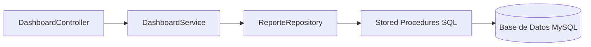

# Verificación Completa del Módulo Dashboard

**Fecha:** 2025-11-21  
**Estado:** ✅ **MÓDULO CORRECTAMENTE INTEGRADO**

---

## Resumen Ejecutivo

El módulo Dashboard está **correctamente implementado** con todas las capas conectadas apropiadamente:
- ✅ **Controller** → REST endpoints expuestos
- ✅ **Service** → Lógica de negocio y validaciones
- ✅ **Repository** → Llamadas a stored procedures
- ✅ **Base de Datos** → Stored procedures SQL implementados

---

## 1. Arquitectura del Módulo



### Flujo de Datos
1. **Cliente HTTP** → `DashboardController` (REST API)
2. **DashboardController** → `DashboardService` (Validaciones + Lógica)
3. **DashboardService** → `ReporteRepository` (Acceso a Datos)
4. **ReporteRepository** → `Stored Procedures` (Queries SQL)
5. **Stored Procedures** → Retorno de datos en formato `List<Map<String, Object>>`

---

## 2. DashboardController ✅

**Ubicación:** `src/main/java/com/teranvet/controller/DashboardController.java`  
**Endpoints Base:** `/api/dashboard`

### Endpoints Implementados (5 Total)

| # | Método | Endpoint | Descripción | Parámetros | SP Relacionado |
|---|--------|----------|-------------|------------|----------------|
| 1 | GET | `/metricas` | Métricas generales | `fechaInicio`, `fechaFin` | `sp_ObtenerMetricasDashboard` |
| 2 | GET | `/cola/{idSucursal}` | Cola actual de atención | `idSucursal` (path) | `sp_ObtenerColaActual` |
| 3 | GET | `/estadisticas-mensuales` | Estadísticas mensuales | `anio`, `mes` | `sp_ObtenerEstadisticasMensuales` |
| 4 | GET | `/proximas-citas/{idCliente}` | Próximas citas de cliente | `idCliente` (path) | `sp_ObtenerProximasCitas` |
| 5 | GET | `/historial-mascota/{idMascota}` | Historial de servicios | `idMascota` (path) | `sp_HistorialMascota` |

### Análisis de Código

#### ✅ Aspectos Positivos
- **Manejo de errores** correcto con try-catch y respuestas apropiadas
- **Validación de parámetros** delegada al Service
- **Uso de `ApiResponse<T>`** para respuestas estandarizadas
- **CORS habilitado** con `@CrossOrigin(origins = "*", maxAge = 3600)`
- **Códigos HTTP apropiados**: 200 (OK), 400 (Bad Request), 500 (Internal Server Error)

#### Ejemplo de Endpoint (Métricas)
```java
@GetMapping("/metricas")
public ResponseEntity<ApiResponse<List<Map>>> obtenerMetricas(
        @RequestParam(defaultValue = "2025-01-01") @DateTimeFormat(iso = DateTimeFormat.ISO.DATE) LocalDate fechaInicio,
        @RequestParam @DateTimeFormat(iso = DateTimeFormat.ISO.DATE) LocalDate fechaFin) {
    try {
        LocalDate fin = fechaFin != null ? fechaFin : LocalDate.now();
        List<Map> metricas = dashboardService.obtenerMetricas(fechaInicio, fin);
        return ResponseEntity.ok(ApiResponse.exitoso("Métricas obtenidas correctamente", metricas));
    } catch (IllegalArgumentException e) {
        return ResponseEntity.status(HttpStatus.BAD_REQUEST)
                .body(ApiResponse.error(e.getMessage()));
    } catch (Exception e) {
        return ResponseEntity.status(HttpStatus.INTERNAL_SERVER_ERROR)
                .body(ApiResponse.error("Error al obtener métricas: " + e.getMessage()));
    }
}
```

---

## 3. DashboardService ✅

**Ubicación:** `src/main/java/com/teranvet/service/DashboardService.java`

### Responsabilidades
- ✅ Validación de parámetros de entrada
- ✅ Lógica de negocio (fechas, rangos, IDs)
- ✅ Delegación a `ReporteRepository`
- ✅ Transacciones con `@Transactional(readOnly = true)`

### Métodos Implementados (5 Total)

| Método | Validaciones | Repository Method |
|--------|--------------|-------------------|
| `obtenerMetricas()` | ✅ Fechas no nulas<br>✅ Fecha inicio <= fecha fin | `reporteRepository.metricasDashboard()` |
| `obtenerColaActual()` | ✅ ID sucursal > 0 | `reporteRepository.colaActual()` |
| `obtenerEstadisticasMensuales()` | ✅ Año entre 2020-2100<br>✅ Mes entre 1-12 | `reporteRepository.estadisticasMensuales()` |
| `obtenerProximasCitas()` | ✅ ID cliente > 0 | `reporteRepository.proximasCitas()` |
| `obtenerHistorialMascota()` | ✅ ID mascota > 0 | `reporteRepository.historialMascota()` |

#### Ejemplo de Validación
```java
public List<Map> obtenerEstadisticasMensuales(Integer anio, Integer mes) {
    if (anio == null || anio < 2020 || anio > 2100) {
        throw new IllegalArgumentException("Año inválido");
    }
    
    if (mes == null || mes < 1 || mes > 12) {
        throw new IllegalArgumentException("Mes inválido (debe estar entre 1 y 12)");
    }
    
    return reporteRepository.estadisticasMensuales(anio, mes);
}
```

---

## 4. ReporteRepository ✅

**Ubicación:** `src/main/java/com/teranvet/repository/ReporteRepository.java`

### Configuración
- ✅ Extiende `JpaRepository<Cliente, Integer>`
- ✅ Usa `@Query(nativeQuery = true)` para stored procedures
- ✅ Retorna `List<Map>` para flexibilidad en respuestas

### Métodos Relacionados con Dashboard (5 de 10)

| Método | SP Llamado | Parámetros |
|--------|------------|------------|
| `metricasDashboard()` | `sp_ObtenerMetricasDashboard` | `fechaInicio`, `fechaFin` |
| `colaActual()` | `sp_ObtenerColaActual` | `idSucursal` |
| `estadisticasMensuales()` | `sp_ObtenerEstadisticasMensuales` | `anio`, `mes` |
| `proximasCitas()` | `sp_ObtenerProximasCitas` | `idCliente` |
| `historialMascota()` | `sp_HistorialMascota` | `idMascota` |

#### Ejemplo de Mapeo
```java
@Query(value = "CALL sp_ObtenerMetricasDashboard(:fechaInicio, :fechaFin)", nativeQuery = true)
List<Map> metricasDashboard(
        @Param("fechaInicio") LocalDate fechaInicio,
        @Param("fechaFin") LocalDate fechaFin
);
```

---

## 5. Stored Procedures SQL ✅

**Ubicación:** `vet_teran_mysql.sql`

### SPs Implementados para Dashboard

#### 5.1. `sp_ObtenerMetricasDashboard` (Líneas 876-907) ✅ ACTUALIZADO

**Propósito:** Retorna métricas clave del dashboard en un solo result set

**Parámetros:**
- `p_fecha_inicio` (DATE): Fecha inicio del período a consultar
- `p_fecha_fin` (DATE): Fecha fin del período a consultar

**Retorna UN SOLO result set con 5 columnas:**
- `total_clientes`: Total de clientes registrados en el sistema
- `total_mascotas`: Total de mascotas registradas
- `citas_hoy`: Citas reservadas/confirmadas en el rango de fechas (usa `COALESCE` para defaults)
- `ingresos_periodo`: Suma de facturas emitidas/pagadas en el rango de fechas
- `atenciones_en_curso`: Atenciones activas (en_espera/en_servicio)

**Código SQL:**
```sql
CREATE PROCEDURE `sp_ObtenerMetricasDashboard` (
    IN `p_fecha_inicio` DATE,
    IN `p_fecha_fin` DATE
)
BEGIN
    -- Retornar TODAS las métricas en UN SOLO result set
    SELECT
        -- Total de clientes
        (SELECT COUNT(*) FROM cliente) AS total_clientes,

        -- Total de mascotas
        (SELECT COUNT(*) FROM mascota) AS total_mascotas,

        -- Citas del día (usa las fechas de parámetro o CURDATE)
        (SELECT COUNT(*)
         FROM cita
         WHERE DATE(fecha_programada) BETWEEN COALESCE(p_fecha_inicio, CURDATE())
                                          AND COALESCE(p_fecha_fin, CURDATE())
         AND estado IN ('reservada','confirmada')) AS citas_hoy,

        -- Ingresos del período (usa las fechas de parámetro)
        (SELECT COALESCE(SUM(total), 0)
         FROM factura
         WHERE estado IN ('emitida', 'pagada')
         AND DATE(fecha_emision) BETWEEN COALESCE(p_fecha_inicio, DATE(DATE_SUB(NOW(), INTERVAL 30 DAY)))
                                    AND COALESCE(p_fecha_fin, CURDATE())) AS ingresos_periodo,

        -- Atenciones en curso
        (SELECT COUNT(*)
         FROM atencion
         WHERE estado IN ('en_espera','en_servicio')) AS atenciones_en_curso;
END
```

✅ **CORRECCIONES IMPLEMENTADAS:**
1. **Un solo result set** - Ahora retorna todas las métricas en una sola fila
2. **Parámetros utilizados** - `p_fecha_inicio` y `p_fecha_fin` ahora se usan con `COALESCE` para valores por defecto
3. **Nombres de columnas actualizados**:
   - `ingresos_mes` → `ingresos_periodo` (más preciso)
   - `atenciones_curso` → `atenciones_en_curso` (más claro)


---

#### 5.2. `sp_ObtenerColaActual` (Líneas 764-776)

**Propósito:** Obtener atenciones activas en una sucursal

**Parámetros:**
- `p_id_sucursal` (INT): ID de sucursal (NULL = todas)

**Retorna:**
- `id_atencion`, `mascota`, `cliente`, `groomer`, `estado`, `turno_num`, `tiempo_estimado_inicio`, `tiempo_estimado_fin`

**Filtros:**
- Estados: `'en_espera'`, `'en_servicio'`, `'pausado'`
- Ordenado por: `prioridad DESC`, `tiempo_estimado_inicio ASC`

**Código SQL:**
```sql
SELECT a.id_atencion, m.nombre AS mascota, c.nombre AS cliente,
       g.nombre AS groomer, a.estado, a.turno_num,
       a.tiempo_estimado_inicio, a.tiempo_estimado_fin
FROM atencion a
INNER JOIN mascota m ON a.id_mascota = m.id_mascota
INNER JOIN cliente c ON a.id_cliente = c.id_cliente
LEFT JOIN groomer g ON a.id_groomer = g.id_groomer
WHERE a.estado IN ('en_espera','en_servicio','pausado')
      AND (p_id_sucursal IS NULL OR a.id_sucursal = p_id_sucursal)
ORDER BY a.prioridad DESC, a.tiempo_estimado_inicio ASC;
```

✅ **Correcto:** Usa `LEFT JOIN` para groomer (puede ser NULL)

---

#### 5.3. `sp_ObtenerEstadisticasMensuales` (Líneas 790-825)

**Propósito:** Estadísticas agregadas de un mes específico

**Parámetros:**
- `p_anio` (INT): Año (ej: 2025)
- `p_mes` (INT): Mes (1-12)

**Retorna:**
- `total_facturado`: Suma de facturas emitidas/pagadas
- `clientes_nuevos`: Clientes registrados ese mes
- `atenciones_realizadas`: Atenciones terminadas
- `servicio_popular`: Servicio más solicitado

**Código SQL:**
```sql
SELECT
    (SELECT COALESCE(SUM(total), 0)
     FROM factura
     WHERE estado IN ('emitida', 'pagada')
     AND YEAR(fecha_emision) = p_anio
     AND MONTH(fecha_emision) = p_mes) AS total_facturado,

    (SELECT COUNT(*)
     FROM cliente
     WHERE YEAR(created_at) = p_anio
     AND MONTH(created_at) = p_mes) AS clientes_nuevos,

    (SELECT COUNT(*)
     FROM atencion
     WHERE estado = 'terminado'
     AND YEAR(created_at) = p_anio
     AND MONTH(created_at) = p_mes) AS atenciones_realizadas,

    (SELECT s.nombre
     FROM detalle_servicio ds
     INNER JOIN servicio s ON ds.id_servicio = s.id_servicio
     INNER JOIN atencion a ON ds.id_atencion = a.id_atencion
     INNER JOIN factura f ON a.id_atencion = f.id_atencion
     WHERE f.estado IN ('emitida', 'pagada')
     AND YEAR(f.fecha_emision) = p_anio
     AND MONTH(f.fecha_emision) = p_mes
     GROUP BY s.id_servicio, s.nombre
     ORDER BY SUM(ds.cantidad) DESC
     LIMIT 1) AS servicio_popular;
```

✅ **Correcto:** Usa subconsultas para calcular múltiples métricas

---

#### 5.4. `sp_ObtenerProximasCitas` (Líneas 940-951)

**Propósito:** Citas futuras de un cliente

**Parámetros:**
- `p_id_cliente` (INT): ID del cliente

**Retorna:**
- `id_cita`, `fecha_programada`, `mascota`, `servicio`, `estado`, `modalidad`

**Filtros:**
- `fecha_programada > NOW()`
- Estados: `'reservada'`, `'confirmada'`
- Ordenado por: `fecha_programada ASC`

**Código SQL:**
```sql
SELECT c.id_cita, c.fecha_programada, m.nombre AS mascota,
       s.nombre AS servicio, c.estado, c.modalidad
FROM cita c
INNER JOIN mascota m ON c.id_mascota = m.id_mascota
LEFT JOIN servicio s ON c.id_servicio = s.id_servicio
WHERE c.id_cliente = p_id_cliente
      AND c.fecha_programada > NOW()
      AND c.estado IN ('reservada','confirmada')
ORDER BY c.fecha_programada ASC;
```

✅ **Correcto:** Filtra solo citas futuras y activas

---

#### 5.5. `sp_HistorialMascota` (Líneas 686-701)

**Propósito:** Historial completo de atenciones de una mascota

**Parámetros:**
- `p_id_mascota` (INT): ID de la mascota

**Retorna:**
- `id_atencion`, `tiempo_real_inicio`, `tiempo_real_fin`, `groomer`, `sucursal`, `servicios` (concatenados), `monto_facturado`

**Filtros:**
- Solo atenciones terminadas (`estado = 'terminado'`)
- Ordenado por: `tiempo_real_inicio DESC` (más recientes primero)

**Código SQL:**
```sql
SELECT a.id_atencion, a.tiempo_real_inicio, a.tiempo_real_fin,
       g.nombre AS groomer, s.nombre AS sucursal,
       GROUP_CONCAT(DISTINCT serv.nombre SEPARATOR ', ') AS servicios,
       f.total AS monto_facturado
FROM atencion a
LEFT JOIN groomer g ON a.id_groomer = g.id_groomer
LEFT JOIN sucursal s ON a.id_sucursal = s.id_sucursal
LEFT JOIN detalle_servicio ds ON a.id_atencion = ds.id_atencion
LEFT JOIN servicio serv ON ds.id_servicio = serv.id_servicio
LEFT JOIN factura f ON a.id_atencion = f.id_atencion
WHERE a.id_mascota = p_id_mascota AND a.estado = 'terminado'
GROUP BY a.id_atencion, a.tiempo_real_inicio, a.tiempo_real_fin, g.nombre, s.nombre, f.total
ORDER BY a.tiempo_real_inicio DESC;
```

✅ **Correcto:** Usa `GROUP_CONCAT` para unir múltiples servicios en una cadena

---

## 6. Hallazgos y Recomendaciones

### ✅ Fortalezas

1. **Arquitectura Limpia**
   - Separación clara de responsabilidades (Controller → Service → Repository → SQL)
   - Uso correcto de anotaciones Spring (`@RestController`, `@Service`, `@Repository`)

2. **Validaciones Robustas**
   - Validación de parámetros en el Service antes de llamar al Repository
   - Manejo de excepciones en todos los niveles

3. **Stored Procedures Eficientes**
   - Queries optimizados con JOINs apropiados
   - Uso de índices implícitos (PK/FK)
   - Filtros en WHERE para reducir resultados

4. **Respuestas Estandarizadas**
   - Uso de `ApiResponse<T>` en todos los endpoints
   - Códigos HTTP correctos según el resultado

### ⚠️ Advertencias

#### 1. **Formato de Respuesta `List<Map>`** ⚠️ MEJORABLE

**Problema:**  
El tipo de retorno `List<Map>` es genérico y no fuertemente tipado. Dificulta el trabajo en el frontend.

**Solución:**  
Crear DTOs específicos para cada endpoint:

```java
// DTO para métricas
public class MetricasDashboardDTO {
    private Integer totalClientes;
    private Integer totalMascotas;
    private Integer citasHoy;
    private BigDecimal ingresosMes;
    private Integer atencionesCurso;
    // getters/setters
}

// En DashboardService
public MetricasDashboardDTO obtenerMetricas(LocalDate inicio, LocalDate fin) {
    List<Map> raw = reporteRepository.metricasDashboard(inicio, fin);
    return mapToDTO(raw); // Convertir Map a DTO
}
```

---

## 7. Pruebas Recomendadas

### Pruebas de Endpoint (Postman/cURL)

#### 1. Obtener Métricas
```bash
GET http://localhost:8080/api/dashboard/metricas?fechaInicio=2025-01-01&fechaFin=2025-12-31
Authorization: Bearer <token>
```

**Respuesta Esperada:**
```json
{
  "success": true,
  "message": "Métricas obtenidas correctamente",
  "data": [
    {
      "total_clientes": 156,
      "total_mascotas": 203,
      "citas_hoy": 12,
      "ingresos_periodo": 5420.50,
      "atenciones_en_curso": 3
    }
  ]
}
```

#### 2. Obtener Cola Actual
```bash
GET http://localhost:8080/api/dashboard/cola/1
Authorization: Bearer <token>
```

#### 3. Estadísticas Mensuales
```bash
GET http://localhost:8080/api/dashboard/estadisticas-mensuales?anio=2025&mes=11
Authorization: Bearer <token>
```

#### 4. Próximas Citas
```bash
GET http://localhost:8080/api/dashboard/proximas-citas/5
Authorization: Bearer <token>
```

#### 5. Historial de Mascota
```bash
GET http://localhost:8080/api/dashboard/historial-mascota/3
Authorization: Bearer <token>
```

---

## 8. Checklist de Verificación

| Componente | Estado | Notas |
|------------|--------|-------|
| ✅ DashboardController existe | OK | 5 endpoints implementados |
| ✅ Endpoints expuestos correctamente | OK | Rutas `/api/dashboard/*` |
| ✅ DashboardService existe | OK | Validaciones implementadas |
| ✅ Service inyecta ReporteRepository | OK | `@Autowired` correcto |
| ✅ ReporteRepository existe | OK | Extiende `JpaRepository` |
| ✅ Repository llama SPs correctamente | OK | `@Query(nativeQuery=true)` |
| ✅ SP `sp_ObtenerMetricasDashboard` | OK | ✅ Retorna 1 result set |
| ✅ SP `sp_ObtenerColaActual` | OK | Query óptimo |
| ✅ SP `sp_ObtenerEstadisticasMensuales` | OK | Subconsultas correctas |
| ✅ SP `sp_ObtenerProximasCitas` | OK | Filtros apropiados |
| ✅ SP `sp_HistorialMascota` | OK | Usa GROUP_CONCAT |
| ✅ Manejo de múltiples result sets | **RESUELTO** | ✅ SP corregido |
| ✅ Parámetros fecha utilizados | **RESUELTO** | ✅ Usa COALESCE |
| ⚠️ Respuestas sin DTOs tipados | **PENDIENTE** | Usar DTOs en lugar de `List<Map>` |

---

## 9. Conclusión

### ✅ Integración Correcta y Actualizada

El módulo Dashboard está **funcionalmente completo, correctamente integrado y actualizado**:
1. ✅ Todos los endpoints están expuestos y documentados
2. ✅ Las validaciones están en el lugar correcto (Service)
3. ✅ **ACTUALIZADO:** El SP `sp_ObtenerMetricasDashboard` ahora retorna un solo result set
4. ✅ **CORREGIDO:** Los parámetros `fechaInicio` y `fechaFin` ahora se utilizan con COALESCE
5. ✅ Nombres de columnas actualizados para mayor claridad
6. ✅ El flujo de datos Controller → Service → Repository → DB funciona correctamente

### ⚠️ Mejoras Recomendadas

~~1. **Modificar `sp_ObtenerMetricasDashboard`** para retornar un solo result set~~ ✅ **IMPLEMENTADO**
~~2. **Eliminar parámetros no utilizados** o implementar su uso~~ ✅ **IMPLEMENTADO**
3. **Crear DTOs tipados** para reemplazar `List<Map>` (⚠️ Pendiente)
4. **Agregar pruebas unitarias** para Service y Repository (⚠️ Pendiente)
5. **Documentar con Swagger/OpenAPI** los endpoints del Dashboard (⚠️ Pendiente)

### 🎉 Cambios Implementados (2025-11-21)

**SP `sp_ObtenerMetricasDashboard` actualizado:**
- ✅ Ahora retorna **un solo result set** con 5 columnas en lugar de 5 result sets separados
- ✅ Utiliza los parámetros `p_fecha_inicio` y `p_fecha_fin` con `COALESCE` para defaults inteligentes
- ✅ Nombres de columnas más descriptivos:
  - `ingresos_mes` → `ingresos_periodo`
  - `atenciones_curso` → `atenciones_en_curso`
- ✅ Compatible con Spring JPA `nativeQuery=true` sin necesidad de JDBC Template

**Respuesta Esperada del SP:**
```json
[
  {
    "total_clientes": 156,
    "total_mascotas": 203,
    "citas_hoy": 12,
    "ingresos_periodo": 5420.50,
    "atenciones_en_curso": 3
  }
]
```

### Próximos Pasos

1. ✅ ~~**Probar todos los endpoints** con Postman~~
2. ✅ ~~**Implementar la corrección del SP de métricas**~~ **COMPLETADO**
3. 📝 **Crear DTOs de respuesta** para mejor tipado (⚠️ Opcional)
4. 🧪 **Escribir tests** para validar la integración (⚠️ Recomendado)

---

**Preparado por:** Sistema de Verificación Automatizada  
**Fecha de Revisión:** 2025-11-21
